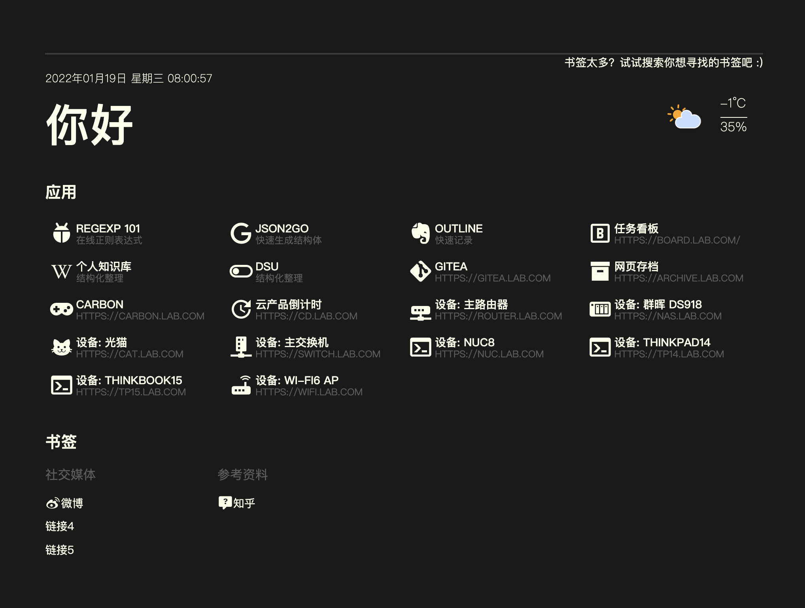
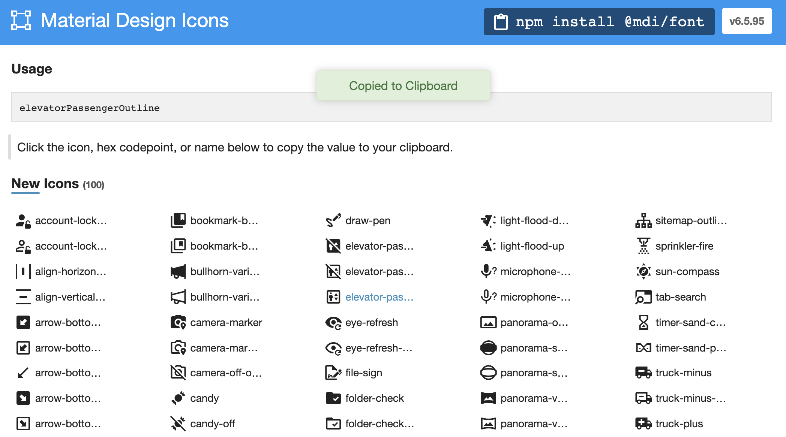

# Flare ✨

轻量、快速、美观的个人导航页面，适用于 HomeLab 或其他注重私密的场景。

无任何数据库依赖，应用数据完全开放透明，100% 属于用户自己。

支持 x86 以及常见的 ARM 设备。

应用资源消耗非常低：

- CPU: < 1%
- MEM: < 30M
- Docker Image: < 10M


## 快速上手

快速上手 Flare，需要两步：**下载**包含示例的代码、**启动**程序访问浏览器。

### 下载包含示例的代码

你可以使用 `git clone` 或者选择使用 “Download ZIP” 的方式，下载包含了基础的配置示例（书签和应用）的代码：

```bash
git clone https://github.com/soulteary/docker-flare.git
cd docker-flare
```

`app/*yml` 目录中包含了你的书签和应用数据，你可以根据你的需求对其进行调整。如果目录中没有配置文件，应用将在首次运行的时候，进行自动创建。

### 启动程序访问浏览器

启动应用非常简单，如果你习惯使用 Docker，可以执行：

```bash
docker run --rm -it -p 5005:5005 -v `pwd`/app:/app soulteary/flare:0.2.5
```

如果你习惯使用 docker-compose：

```bash
docker-compose up -d
```

在命令执行完毕之后，默认访问浏览器的 `5005` 端口，就能看到下面的界面啦：




## 进阶文档

- [自定义启动参数](./docs/advanced-startup.md)
- [关闭免登陆模式后，如何设置用户账号](./docs/application-account.md)
- [如何挑选和使用图标](./docs/material-design-icons.md)
- [如何和 Traefik 一起使用](https://github.com/soulteary/traefik-example)

## 相比较 Flame

- 服务资源消耗极低，可以跑在任何规格的机器上，甚至是一台搭载2015年S805芯片的ARM盒子。
- 程序页面性能非常好，渲染速度更快，支持同时渲染大量（数千）书签，而不必担心风扇起飞。
- 使用声明的配置来进行导航内容的管理，无需担心数据迁移问题。
- 简化了天气数据的获取方式，不再需要申请天气网站的 `API_KEY` ，避免了不必要的成本开销。
- 简化了 Flame 中的K8S、Docker 集成等不必要的功能。
- 内置了大量风格统一、高质量的矢量图标，减少选择困难症，确保界面长期“耐看”。
- 默认使用免登陆模式，避免 HomeLab、本地使用的用户有额外的登陆操作。

## 关于内置图标

程序内置了目前 [materialdesignicons.com](https://materialdesignicons.com/) 中所有的 Material Design Icons，你可以让你的每一个书签都拥有风格统一、高质量的矢量图标。



更多信息，可以参考 [如何挑选和使用图标](./docs/material-design-icons.md)。

## TODO

- [ ] 持续完善程序定制化功能
- [ ] 支持使用 API 进行内容管理
- [ ] 支持自定义主题配色

## Thanks

Inspired by https://github.com/pawelmalak/flame
